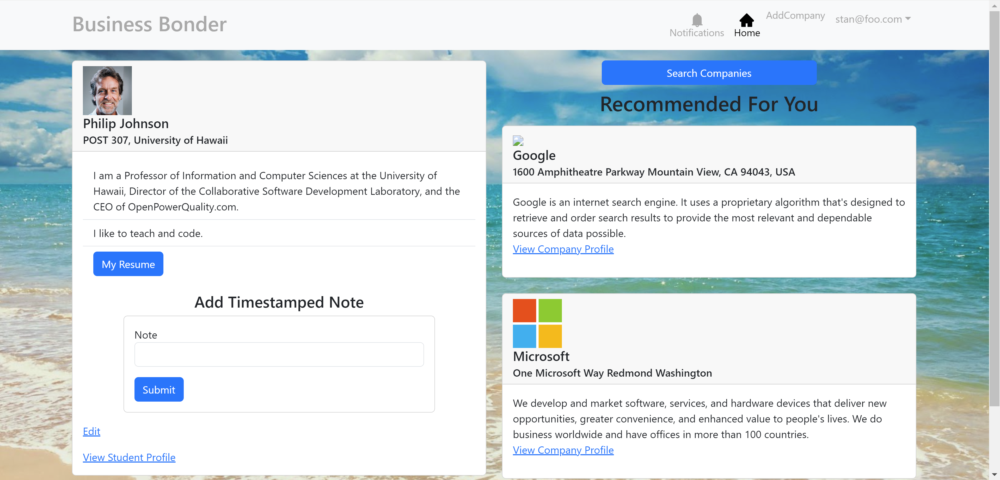

  

The Business Bonders project was my final group project for ICS 314. It is a webapp created using Meteor, React Bootstrap, JavaScript, and HTML. It aims to connect companies and students with each other, and help employers find the right candidates they need for their job positions. Likewise, it also helps students find the companies that most closely align with their skills and visions. Finding jobs out of college is difficult, and we attempted to make a tool that would give students oppurtunities for success. In order to install the project, you first need to install Meteor. Then, visit the Business Bonder github page, and  download the zip file provided. Next, download a copy of the repo to your local computer. After that, open command prompt and cd into the business_bonder/app directory and install the meteor libraries with meteor npm install. Lastly, run the system with meteor npm run start, and the webapp will run in your browser on http://localhost:3000. This project completed done over the course of a month, and accomplished with three other members. 

This project has given me much experience working with Meteor, React Bootstrap, HTML, and JavaScript. I have also gained a newfound appreciation for Meteor, and I think that it is something that I would want to work with in the future as well. My knowledege of all of these languages and frameworks was close to nothing before this project, but I feel that I have gained much greater competency with all of them now. Also, during this project, our group was permitted to use Artificial Intelligence to help us solve problems. I think that this was very beneficial to me because not only was it able to help me speed up the process of creating the project, but it also allowed me to better understand how Artificial Intelligence works. Over the course of the project, I primarily made use of ChatGPT to solve problems, and working with it taught me a lot. One key takeaway from using ChatGPT was that it was better at answering problems incrementally, with specific questions. Asking it to create something that was more complex would likely result in it giving something completely inaccurate. However, with small, precise questions, it was able to eventually get to the correct answer itself. I feel that this was very important for me to get acclimated to, as I believe that Artificial Intelligence will have a big place in our future, and learning to use it effectively early will give me an edge later once it becomes more reliable. 

This project also developed my collaboration and cooperation. Since this was a group project, proper organization was key for everyone to work efficiently. This is why my group made use of both Discord and Project Sheets to keep track of progress and updates to our branches. Throughout the project, we constantly kept in contact in order to keep the project on pace. 

You can learn more at the (https://business-bonder.github.io/).
