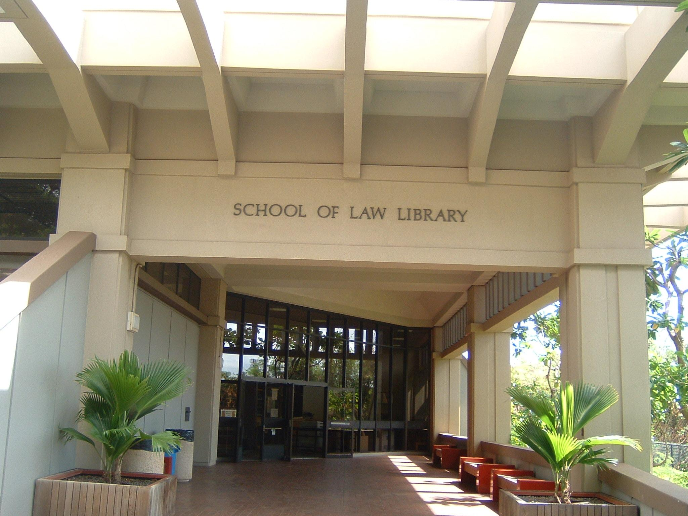

  

The UH Manoa Law Library was founded by C.J. Richardson and Dean David R. Hood in September 1973. The library has information ranging from all types of Law, such as local Hawaiian and island laws to international law and law in overseas countries. It was created with law students in mind, and attempts to give them all the resources they need to be successful in their major. It serves as a treasure trove of information for these students, and always attempts to accommodate their needs with technology that can be borrowed and quiet areas for them to focus. It is also open 24/7, so law students have the freedom to come in on their own time to study and read. 

I am currently am working the UH Manoa Law Library and have been working at there for about a month. Although my time there has been short so far, I have learned a lot from being there already. Being at the library has made sure that I stay organized, as the way that things need to be kept track of is very meticulous. Each book must be accounted for, and most media at the Law Library must be archived and stored somewhere. This means that in order to stay on top of everything, I have to be organized, and prepared for any new books that come my way. I am also responsible for monitoring the front desk. Any questions that are asked I need to be prepared for, and there are protocols in place for how to respond to different types of questions. Watching the front desk, responding to emails, and answering the phone all have helped me to build my ability to provide customer service. I feel much more prepared to talk to customers and assist them than I was before I started this job. Overall, I would say that working at the Law Library has substantially improved my ability to both help others, and stay organized. 

You can learn more at the (https://law.hawaii.edu/).
